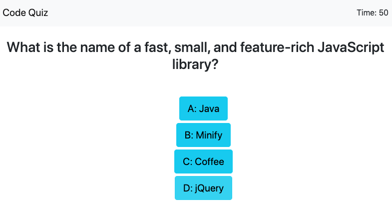

# Homework Assignment #4: Code Quiz

## Overview

This assignment demonstrates skills learned so far in the bootcamp by creating a code quiz of JavaScript knowledge. The purpose of this project is to demonstrate my knowledge and understanding of how to put everything we have learned so far into practice. This assignment was completed using jQuery, Bootstrap, HTML, CSS, as well as various components of JavaScript, including functions, arrays, JSON parsing, local storage, and event listeners.

> All code in this assignment was created by me. There was no preset code or boilerplate code to use for this assignment

## Link to Deployed Application

[code-quiz](https://matthewbush55.github.io/code-quiz/)

## Mock-Up

